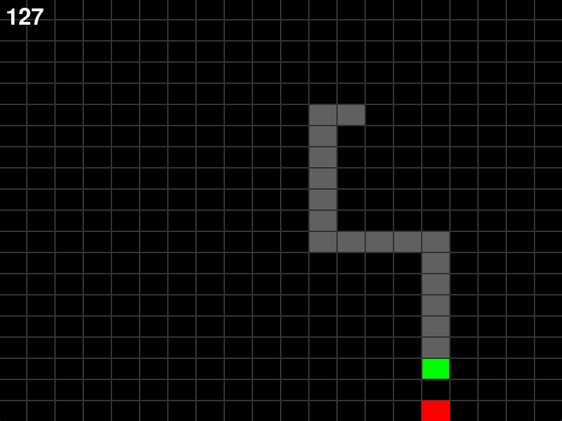
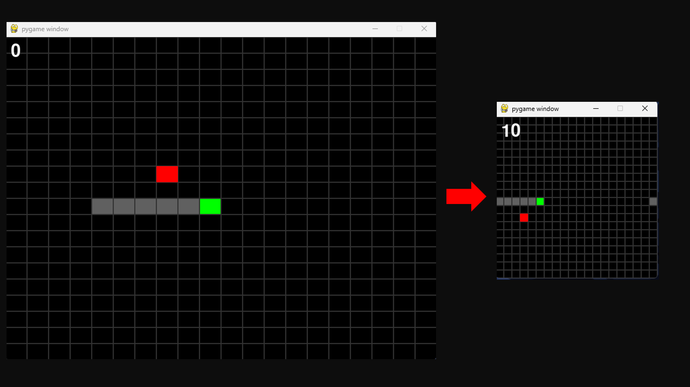
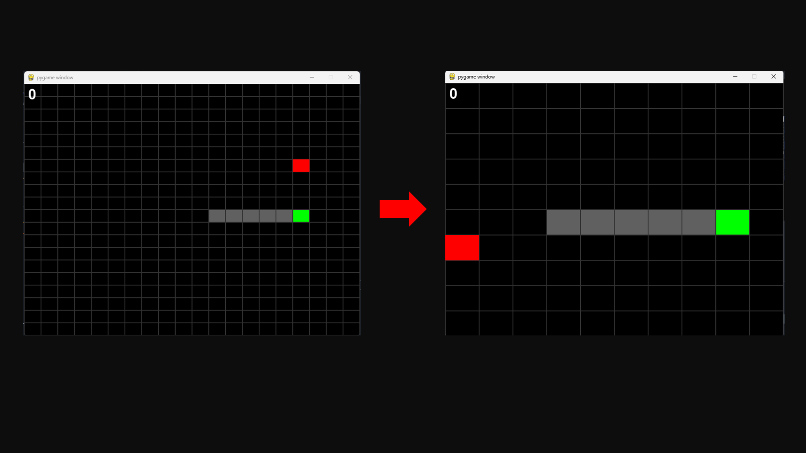

# Snake Game
A simple snake game :P





## Install
- Make sure you got:
  * [Python => 3.10](https://www.python.org/downloads/release/python-3100/)
  * [PIP](https://pip.pypa.io/en/stable/installation/)
  * [PYTHONPATH](https://docs.python.org/3.10/using/cmdline.html#envvar-PYTHONPATH)


- Install dependencies
 ```bash
 pip install -r requirements.txt
 ```

- [x] You're ready to run and execute this project:
```bash
 py ./main.py
```

## Config

On `gameloop.py` you can setup game settings like

* SCREEN_WIDTH, SCREEN_HEIGHT:


* Map grid - Map(x, y):
